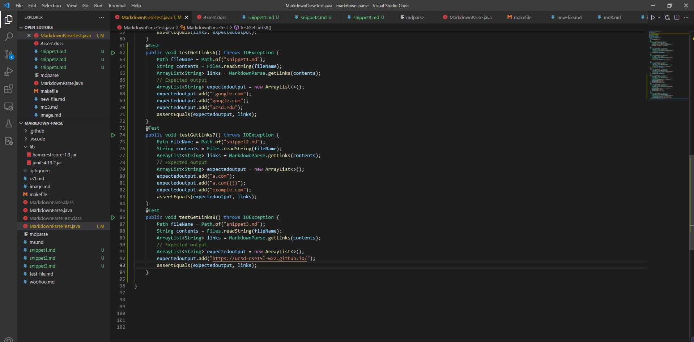
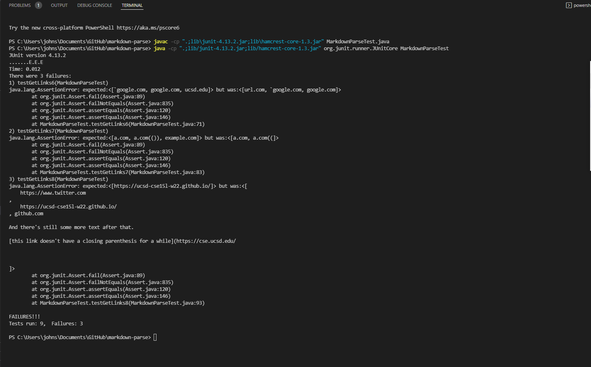
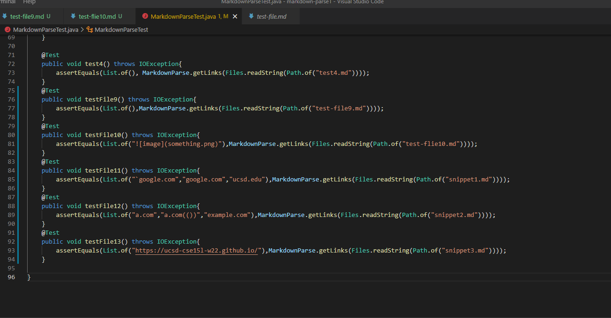
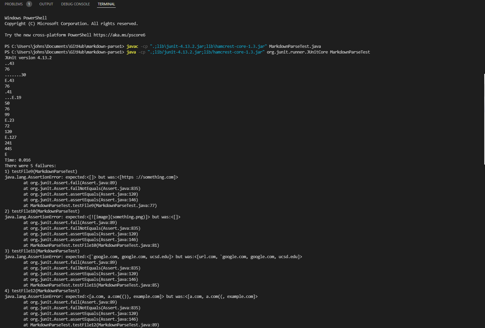
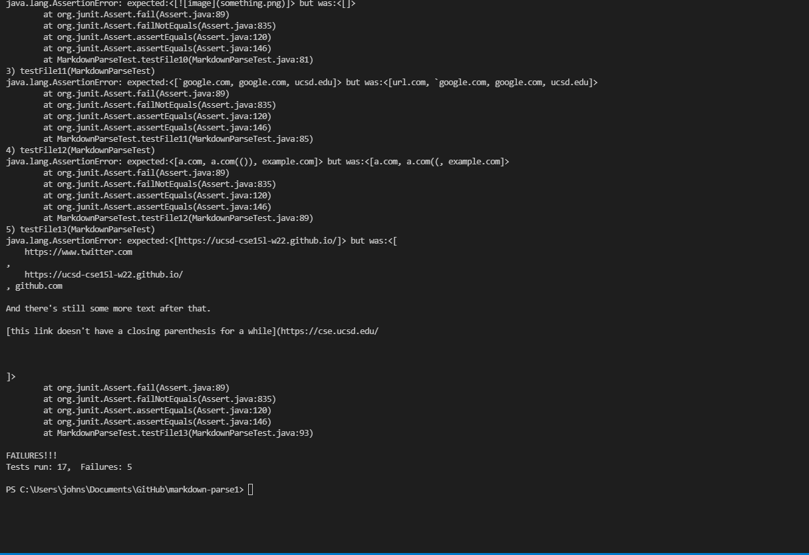

**Lab Report 4**
>
**Name:Junpeng Li(Johnson)**
>
**Professor Joe**
>
**CSE 15L**
>
___
## Link to my markdown-parse repository
[myMarkdown-parse](https://github.com/johnsonli010801/markdown-parse)
>
## Link to the repository that I review
[review-Markdown-Parse](https://github.com/Darrengn/markdown-parse)
___
# Expected output for each snippet
>
**snippet1 expected output in CommonMark demo site [link](https://spec.commonmark.org/dingus/)**

___
```
Expected will be [`google.com, google.com, ucsd.edu]
```
>
**snippet2 expected output in CommonMark demo site**

___
```
Expected will be [a.com, a.com(()), example.com]
```
>
**snippet3 expected output in CommonMark demo site**

___
```
Expected will be [https://ucsd-cse15l-w22.github.io/]
```
>
# Test cases within my repository


___
>
Literally, all the three test cases within my program has failed. The output console in the terminal is shown above. Most likely, the java program within my repository did not cover those special cases of links.
>
___
# Test cases within the review implementation repository

**Terminal**:


>
Actually, all the test cases within the program that our lab group reviewed last week are also failed because the program did not complementarily cover those special link cases.

# Answer toward the three questions:
*Do you think there is a small(<10 lines) code change that will make your program work for snippet 1 and all related cases that use inline code with backticks? If yes describe the code change. If not, describe why it would be a more involved change.*
>
For fixing the output of snippet 1, it might be somehow more than 10 lines code change because what I should do is to handle the code format within github language. There might be serveral cases to be considered. For instance, if the code format is inside the open and close brackets, if one of the bracket is inside the code format, and so on. Hence we might need some more interchange codes to consider those serveral cases.
>
*Do you think there is a small(<10 lines) code change that will make your program work for snippet 2 and all related cases that use inline code with backticks? If yes describe the code change. If not, describe why it would be a more involved change.*
> 
I don't think there will be a way to fix the program for handing the nested parenthesis within the actual link .To handle the nested parenthesis, we will need to consider more special cases of nested parenthesis. For instance, what would happen if the nested parenthesis appears inside brackets or nested parenthesises apeears inside the actual link parenthesises. As long as we need more than 10 codes to handle this case, then we will also need to fix why the third expected link does not appear in the actual shown list.
>
*Do you think there is a small(<10 lines) code change that will make your program work for snippet 2 and all related cases that use inline code with backticks? If yes describe the code change. If not, describe why it would be a more involved change.*
> 
It will actually involve more code editing within  the program to handle snippet 3 because first of all, we will need to handle the case where the link doesn't have a closeing parenthesis, then handle the space  or line even more line breaks between the closebracket and first openparen. Next we will also need to trim the space within the link for show the only useful part of the link
>
___
Thank you for reviewing the lab-report
