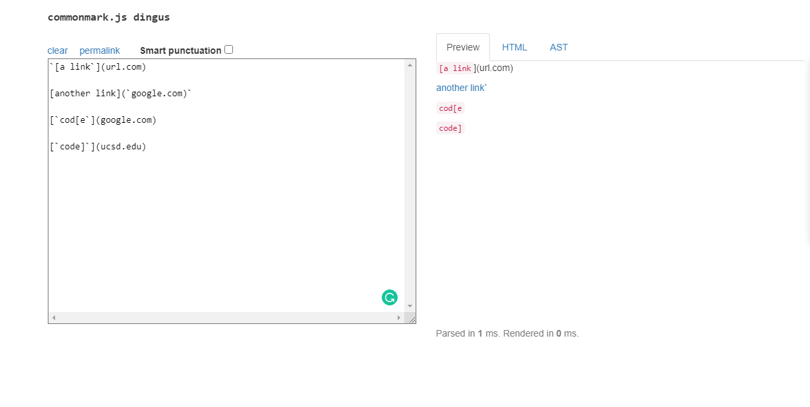
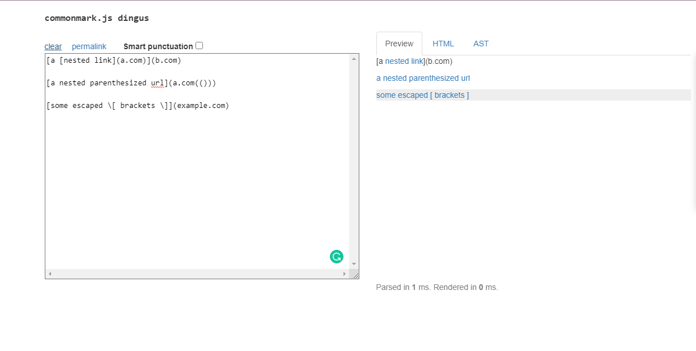
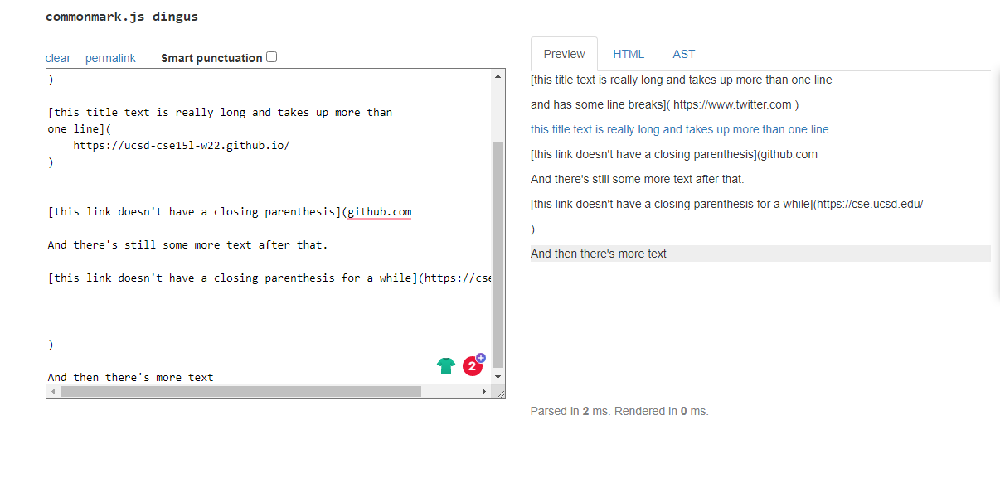

**Lab Report 4**
>
**Name:Junpeng Li(Johnson)**
>
**Professor Joe**
>
**CSE 15L**
>
___
## Link to my markdown-parse repository
[myMarkdown-parse](https://github.com/johnsonli010801/markdown-parse)
>
## Link to the repository that I review
[review-Markdown-Parse](https://github.com/Darrengn/markdown-parse)
___
# Expected output for each snippet
>
**snippet1 expected output in CommonMark demo site [link](https://spec.commonmark.org/dingus/)**

___
```
Expected will be [`google.com, google.com, ucsd.edu]
```
>
**snippet2 expected output in CommonMark demo site**

___
```
Expected will be [a.com, a.com(()), example.com]
```
>
**snippet3 expected output in CommonMark demo site**

___
```
Expected will be [https://ucsd-cse15l-w22.github.io/]
```
>


